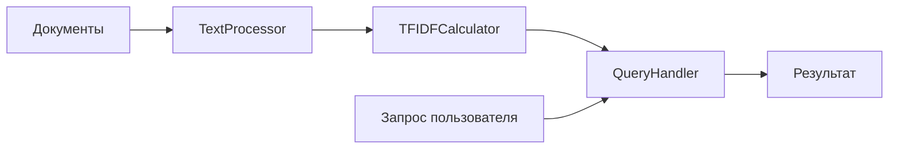

# 📊 TF-IDF Text Analyzer

<div align="center">


**Анализ текстовых документов с использованием модели TF-IDF**

*Лабораторная работа №4 по курсу "Highload Systems Engineering"*

</div>

---

## 📋 Оглавление

- [📖 О проекте](#-о-проекте)
- [✨ Возможности](#-возможности)
- [🏗 Архитектура](#-архитектура)
- [🚀 Быстрый старт](#-быстрый-старт)
- [💬 Команды](#-команды)
- [📐 Теоретическая справка](#-теоретическая-справка)
- [📁 Структура проекта](#-структура-проекта)
- [🔧 Сборка и запуск](#-сборка-и-запуск)
- [🎮 Примеры использования](#-примеры-использования)
- [⚠️ Возможные проблемы](#️-возможные-проблемы)
- [📈 Возможные улучшения](#-возможные-улучшения)

---

## 📖 О проекте

**TF-IDF Text Analyzer** — это программа для анализа текстовых документов, реализующая модель **TF-IDF** (Term Frequency — Inverse Document Frequency). Проект демонстрирует современный подход к обработке текстовых данных на C++ с использованием стандартной библиотеки шаблонов (STL).

### 🎯 Цель работы

Закрепление навыков работы с:
- Контейнерами STL (`vector`, `unordered_map`, `set`)
- Алгоритмами STL (`sort`, `transform`, `for_each`, `accumulate`)
- Лямбда-функциями
- Обработкой файлового ввода/вывода

---

## ✨ Возможности

| Функция | Описание |
|---------|----------|
| 🔍 **Загрузка документов** | Чтение текстовых файлов из списка |
| 🧹 **Предобработка текста** | Приведение к нижнему регистру, удаление пунктуации |
| 📊 **Вычисление TF** | Частота слова в документе |
| 🌍 **Вычисление IDF** | Редкость слова в коллекции документов |
| 📈 **Вычисление TF-IDF** | Комбинированная метрика важности |
| 💬 **Обработка запросов** | 4 типа интерактивных запросов |

---

## 🏗 Архитектура



### Модули:

| Модуль | Ответственность |
|--------|-----------------|
| **TextProcessor** | Токенизация, очистка текста, приведение к нижнему регистру |
| **TFIDFCalculator** | Вычисление TF, IDF, TF-IDF для всех слов и документов |
| **QueryHandler** | Парсинг и обработка пользовательских запросов |

---

## 🚀 Быстрый старт

### 📋 Требования

- **C++17** компилятор (GCC 7+, Clang 5+, MSVC 2017+)
- **CMake** 3.20 или выше
- **Git** (опционально)

### 💾 Установка

```bash
# Клонирование репозитория
git clone https://github.com/yourusername/TFIDFAnalyzer.git
cd TFIDFAnalyzer

# Создание директории для сборки
mkdir build && cd build

# Генерация файлов сборки
cmake ..

# Компиляция
cmake --build .

# Запуск
./TFIDFAnalyzer
```

---

## 💬 Команды

### 1️⃣ WORD — статистика по слову

```bash
WORD learning
```

<details>
<summary>📤 Пример вывода</summary>

```
Word: learning
Documents total: 3
Documents with word: 2
IDF: 0.4055
Appears in:
 - data/doc1.txt
 - data/doc3.txt
```
</details>

### 2️⃣ WORD_IN_DOC — статистика слова в документе

```bash
WORD_IN_DOC machine data/doc1.txt
```

<details>
<summary>📤 Пример вывода</summary>

```
Word: machine
Document: data/doc1.txt
Count: 3
TF: 0.0625
TF-IDF: 0.0253
```
</details>

### 3️⃣ DOC — статистика по документу

```bash
DOC data/doc1.txt
```

<details>
<summary>📤 Пример вывода</summary>

```
Document: data/doc1.txt
Total words: 48
Unique words: 28
Top words:
 1. learning (0.0937)
 2. machine (0.0625)
 3. data (0.0625)
 4. models (0.0417)
 5. artificial (0.0208)
```
</details>

### 4️⃣ QUERY — поиск документов

```bash
QUERY machine learning
```

<details>
<summary>📤 Пример вывода</summary>

```
Query: machine learning
Results:
 1. data/doc1.txt (0.1250)
 2. data/doc3.txt (0.0625)
 3. data/doc2.txt (0.0000)
```
</details>

### 5️⃣ EXIT — выход

```bash
EXIT
```

---

## 📐 Теоретическая справка

### 🧮 TF (Term Frequency)

Частота слова в документе — показывает, насколько часто слово встречается в конкретном документе.

<div align="center">

```
TF(w, d) = count(w, d) / |d|
```

</div>

| Параметр | Описание |
|----------|----------|
| `count(w, d)` | Количество вхождений слова `w` в документ `d` |
| `|d|` | Общее количество слов в документе |

### 🌍 IDF (Inverse Document Frequency)

Обратная частота документа — показывает, насколько слово является редким во всей коллекции.

<div align="center">

```
IDF(w) = log(N / df(w))
```

</div>

| Параметр | Описание |
|----------|----------|
| `N` | Общее количество документов |
| `df(w)` | Количество документов, содержащих слово `w` |

### ⚡ TF-IDF

Итоговая метрика важности слова.

<div align="center">

```
TF-IDF(w, d) = TF(w, d) × IDF(w)
```

</div>

> 💡 **Интерпретация**: Высокое значение TF-IDF получают слова, которые часто встречаются в документе, но редко — в других документах.

---

## 📁 Структура проекта

```
TFIDFAnalyzer/
│
├── 📄 CMakeLists.txt              # Конфигурация сборки
├── 📄 README.md                   # Документация
├── 📄 documents.txt               # Список файлов документов
│
├── 📁 data/                       # Документы для анализа
│   ├── 📄 doc1.txt
│   ├── 📄 doc2.txt
│   └── 📄 doc3.txt
│
├── 📁 src/                        # Исходный код
│   ├── 📄 main.cpp                # Точка входа
│   ├── 📄 TextProcessor.h         # Обработка текста (заголовок)
│   ├── 📄 TextProcessor.cpp       # Обработка текста (реализация)
│   ├── 📄 TFIDFCalculator.h       # Вычисления TF-IDF (заголовок)
│   ├── 📄 TFIDFCalculator.cpp     # Вычисления TF-IDF (реализация)
│   ├── 📄 QueryHandler.h          # Обработка запросов (заголовок)
│   └── 📄 QueryHandler.cpp        # Обработка запросов (реализация)
│
└── 📁 build/                      # Сборочная директория (создаётся автоматически)
```

---

## 🔧 Сборка и запуск

### 🐧 Linux / 🍎 macOS

```bash
# Установка CMake (при необходимости)
sudo apt-get install cmake        # Ubuntu/Debian
brew install cmake                 # macOS

# Сборка проекта
cd /path/to/TFIDFAnalyzer
mkdir build && cd build
cmake ..
make

# Запуск
./TFIDFAnalyzer
```

### 🪟 Windows

**CLion:**
1. `File` → `Open` → выберите папку проекта
2. `Run` → `Edit Configurations`
3. Установите Working directory: `C:\Users\lipen\CLionProjects\TFIDFAnalyzer`
4. `Build` → `Build Project`
5. `Run` → `Run`

**Командная строка:**
```cmd
cd C:\path\to\TFIDFAnalyzer
mkdir build
cd build
cmake .. -G "Visual Studio 17 2022"
cmake --build . --config Release
cd Release
TFIDFAnalyzer.exe
```

---

## 🎮 Примеры использования

### Полная сессия работы

```bash
TF-IDF Text Analyzer
====================

Current working directory: "C:\Users\lipen\CLionProjects\TFIDFAnalyzer\cmake-build-debug"
Found documents.txt at: ../documents.txt
Loading 3 documents...
Documents loaded successfully!
Total unique words: 65

Available commands:
  WORD <word>                         - Statistics for a word across all documents
  WORD_IN_DOC <word> <document>       - Statistics for a word in a specific document
  DOC <document>                      - Statistics for a document (top 5 words)
  QUERY <word1> <word2> ...           - Search for documents matching query
  EXIT                                - Exit the program

> WORD learning
Word: learning
Documents total: 3
Documents with word: 2
IDF: 0.4055
Appears in:
 - data/doc1.txt
 - data/doc3.txt

> QUERY artificial intelligence
Query: artificial intelligence
Results:
 1. data/doc1.txt (0.0416)
 2. data/doc3.txt (0.0000)
 3. data/doc2.txt (0.0000)

> EXIT
Goodbye!
```

---

## ⚠️ Возможные проблемы

| Проблема | Решение |
|----------|---------|
| 🔴 `Cannot open documents.txt` | Поместите `documents.txt` в рабочую директорию или настройте Working directory в CLion |
| 🔴 `Document file not found` | Проверьте пути в `documents.txt`. Используйте `../data/doc1.txt` если нужно |
| 🔴 `Total unique words: 0` | Убедитесь, что документы не пустые и содержат текст |
| 🔴 `std::accumulate is not a member of 'std'` | Добавьте `#include <numeric>` в `QueryHandler.cpp` |
| 🔴 `filesystem error` | Добавьте `target_link_libraries(TFIDFAnalyzer stdc++fs)` в CMakeLists.txt |

---

## 📈 Возможные улучшения

- [ ] **Стемминг** — приведение слов к нормальной форме
- [ ] **Стоп-слова** — игнорирование часто встречающихся слов (предлоги, союзы)
- [ ] **Кэширование** — ускорение повторных запросов
- [ ] **Экспорт** — выгрузка результатов в JSON/CSV
- [ ] **Параллелизм** — многопоточная обработка документов
- [ ] **Графический интерфейс** — простая GUI обёртка
- [ ] **Поддержка больших файлов** — потоковая обработка

---

## 📚 Используемые технологии

<div align="center">

| Технология | Назначение |
|------------|------------|
| **C++17** | Язык программирования |
| **STL** | Стандартная библиотека шаблонов |
| **CMake** | Система сборки |
| **Git** | Контроль версий |

</div>

---

## 📝 Примечания по реализации

- ✅ **Нет явных циклов** — все итерации заменены алгоритмами STL
- ✅ **Лямбда-функции** — используются для всех предикатов и операций
- ✅ **Контейнеры STL** — `vector`, `unordered_map`, `set`
- ✅ **Алгоритмы STL** — `sort`, `transform`, `copy_if`, `find_if`, `for_each`, `accumulate`

---

## 📄 Лицензия

Этот проект создан в рамках лабораторной работы №4 по курсу **"Highload Systems Engineering"**.

<div align="center">

**Дедлайн: 22:00, 31 мая 2026 г.**

[](https://forms.yandex.ru/u/69e7b1ad5056905041f9aec5)

</div>

---

## 👨‍💻 Автор - Поликарпова Дарья

Лабораторная работа №4  
*Highload Systems Engineering*  
2025-2026 учебный год

<div align="center">

**Happy Coding!** 🚀

</div>
